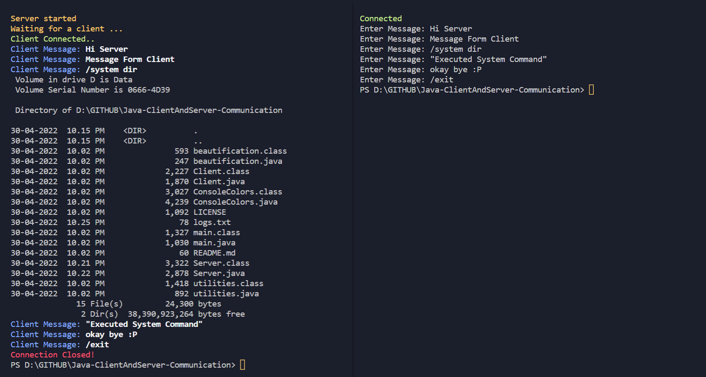

  

<h1 align="center">Java-ClientAndServer-Communication</h1>

A simple Java Sockets-based console application for sending messages from the client to the server.

<h2>Source & Class File Details:</h2>

Execute :  `main.java`
- main.java: Contains Login and Execution of Server/Client as per user choice

- utilities.java: contains basic system function
- ConsoleColors.java: contains color codes 
- beautification.java: contains effect(s) methods

<h2>Runtime Screenshot:</h2>

  

  

